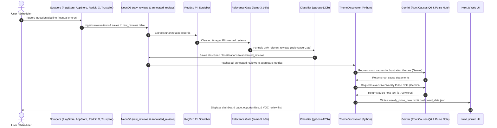

# ⚡ Zepto AI-Powered Cross-Category Discovery Engine (PRDE)

An end-to-end AI-powered product analytics pipeline that ingests multi-source Zepto user reviews, scrubs PII locally, annotates feedback via a Groq-hosted LLM (with model agnostic configs), stores data persistently in NeonDB (PostgreSQL) using incremental classification, aggregates cross-category insights, and generates executive weekly pulse notes via Google Gemini 2.5 Flash + a synchronized JSON dashboard. The application features a responsive Next.js frontend with premium analytics visualisations and a FastAPI backend with real-time log streaming over Server-Sent Events (SSE).

[](https://www.python.org/)
[](https://nextjs.org/)
[](https://fastapi.tiangolo.com/)
[](https://neon.tech/)

---

## 📋 Table of Contents

1. [System Overview & Architecture](#-system-overview--architecture)
2. [E2E Pipeline Workflow](#-e2e-pipeline-workflow)
3. [Phase-by-Phase Breakdown](#-phase-by-phase-breakdown)
4. [Directory Structure](#-directory-structure)
5. [Prerequisites](#-prerequisites)
6. [Setup & Installation](#-setup--installation)
7. [Running the Pipeline](#-running-the-pipeline)
8. [Testing Suite](#-testing-suite)
9. [Web UI: Run, Observe & Analyze](#-web-ui-run-observe--analyze)
10. [Key Design Decisions](#-key-design-decisions)
11. [Known Limitations](#-known-limitations)

---

## 🏗️ System Overview & Architecture

The project is organized into two primary blocks: the **Core Data Pipeline** (Python backend with NeonDB database storage + FastAPI server) and the **Executive Web Dashboard** (Next.js App Router). The pipeline is split into modular phases that run, test, and verify operations.

```mermaid
graph TD
    %% Phase 1: Source Ingestion
    subgraph Ingestion ["Phase 1 - Ingestion & PII Scrubbing"]
        A1[Google Play Store] -->|google-play-scraper| B[IngestionManager]
        A2[Apple App Store] -->|iTunes RSS JSON Feed| B
        A3[Reddit Discussions] -->|Search Query via Playwright| B
        A5[Twitter/X Conversations] -->|Playwright Scrape| B
        A6[Trustpilot] -->|BeautifulSoup + Playwright| B
        B -->|"Emoji strip, Dedup, 5-word filter, Spam detect"| C1[raw_reviews.csv]
        C1 -->|NeonDB raw_reviews table write| C2[(NeonDB Raw Reviews)]
        C2 -->|PIIScrubber - RegEx Masking| C3[reviews.csv]
    end

    %% Phase 2: LLM Optimization & Gate Funnel
    subgraph Phase2 ["Phase 2 - LLM-Optimized Annotation"]
        C3 -->|Incremental check: SELECT WHERE annotated_at IS NULL| D1[New Reviews Queue]
        D1 -->|Stratified Sampler| D3[Sampled Reviews]
        D3 -->|Relevance Gate Funnel: llama-3.1-8b-instant| D4[Gate Decision]
        D4 -->|Yes: Relevant| D5[Classifier Model: gpt-oss-120b]
        D4 -->|No: Irrelevant| D2[Fallback Neutral Mapping]
        D2 & D5 -->|NeonDB annotated_reviews write| D6[(NeonDB Annotated Reviews)]
    end

    %% Phase 3: Local Aggregation & Theme Discovery
    subgraph Phase3 ["Phase 3 - Local Aggregation & Theme Discovery"]
        D6 -->|ThemeDiscoverer| E1[8 Core Business Questions]
        E1 -->|Counts & Averages in Python| E2[Root Causes Q6: Gemini 2.5 Flash]
        E1 -->|% Sample & % Negative Q7| E3[Opportunity Scores Q8]
        E2 & E3 --> E4[analysis_results.json]
    end

    %% Phase 4+5: Reporting & Orchestration
    subgraph Reporting ["Phases 4 & 5 - Reporting & Orchestration"]
        E4 -->|Gemini 2.5 Flash Pulse Note Generator| F1[weekly_pulse_note.md]
        E4 -->|JSONExporter| F2[data/dashboard_data.json]
        F1 & F2 -->|E2E Orchestrator: src/main.py| F3[Pipeline Orchestrated Outcomes]
    end

    %% Backend Server
    subgraph Server ["FastAPI Server - src/server.py"]
        G1["GET /api/dashboard"]
        G2["POST /api/run-pipeline (SSE Log Stream)"]
    end

    %% Frontend
    subgraph Frontend ["Next.js Frontend - frontend/"]
        H1[Next.js Visualizer Pages] -->|GET /api/dashboard| G1
        H1 -->|SSE Log Stream| G2
        H1 --> H2["/dashboard - Recharts (Pie & Radar)"]
        H1 --> H3["/pulse-note - Markdown Viewer"]
        H1 --> H4["/opportunities - AI Opportunity Cards"]
        H1 --> H5["/voice-of-customer - Review text feed via /api/voc"]
    end

    style Ingestion fill:#1e1e24,stroke:#444,stroke-width:1px
    style Phase2 fill:#1a1f30,stroke:#444,stroke-width:1px
    style Phase3 fill:#171c26,stroke:#444,stroke-width:1px
    style Reporting fill:#1a2324,stroke:#444,stroke-width:1px
    style Server fill:#1c1e20,stroke:#444,stroke-width:1px
    style Frontend fill:#15221b,stroke:#444,stroke-width:1px
```



---

## 🔄 E2E Pipeline Workflow

The pipeline executes sequentially across 6 phases:

```
[Scrapers] ──► [Clean / Scrub] ──► [Stratified Sample S4] ──► [Strategy 5: Two-Stage Gate]
                                                                      │ (batches of 10 via llama-3.1-8b-instant)
                                             ┌────────────────────────┴────────────────────────┐
                                             ▼ [Gate: YES]                                     ▼ [Gate: NO]
                                    [Full LLM Classify]                             [Fallback Neutral Mapping]
                        (batches of 5 via openai/gpt-oss-120b)                 (delivery complaints, etc. Gated out)
                                             │                                                 │
                                             └────────────────────────┬────────────────────────┘
                                                                      ▼
                                                             [Local Aggregation]
                                                                      │
                                                                      ▼
                                                      [Pulse Note ≤700w] + [JSON Export]
                                                                      │
                                                                      ▼
                                                                 [Dashboard]
```

1. **Phase 1 — Ingest & PII Scrub** (`src/ingestion/`): Five concurrent scrapers (`PublicReviewScraper`) harvest reviews from Google Play Store (`google-play-scraper`, up to 2 000 reviews), Apple App Store (iTunes RSS JSON feed), Reddit (search-query via Playwright headless Chromium), Twitter/X (`@ZeptoNow` mentions via Playwright), and Trustpilot (BeautifulSoup + Playwright). Raw reviews per channel are saved to `data/raw/` CSV files and then bulk-inserted into the NeonDB `raw_reviews` table via `NeonClient`. The full deduplicated set is pulled back from NeonDB and passed through `IngestionManager`: emoji stripping, 5-word sentence filter, rules-based spam detection (keyword + character-repeat + triple-word checks), and text-level deduplication. Finally, `PIIScrubber` applies five deterministic regex passes (email → IP → phone → Reddit handle → social @handle), producing the clean `data/processed/reviews.csv`.

2. **Phase 2 — Incremental LLM Classification & [S4] Stratified Sampling** (`src/processing/`): `ReviewProcessor.process_reviews_optimized()` first queries NeonDB's `annotated_reviews` table and filters the input DataFrame to only rows whose `db_id` is not already annotated — enabling true incremental runs with zero re-processing of historical data. **[S4 — Stratified Sampler]** (`sampler.py`): the unclassified pool is then sampled via `stratified_sample()` (target: 500 reviews by default, configurable). Minority sources (`reddit`, `product_reviews`, `twitter`) are always fully included via a min-floor guarantee; majority sources (`app_store`, `google_play`) receive a proportional budget that is further stratified by star-rating band (1–5★ + unrated) using `random_state=42` for reproducibility. Coverage metadata (`total_reviews`, `sampled_count`, `coverage_pct`, per-source breakdown) is saved to `sample_coverage.json`.

3. **Phase 2 (cont.) — [S5] Two-Stage Relevance Gate & Full Classification** (`src/processing/review_processor.py`): The stratified sample enters the **Strategy 5 gate funnel**. Reviews are batched in groups of 10 and sent to Groq `llama-3.1-8b-instant` via `analyze_gate_batch()` for a cheap yes/no relevance decision. Gate-rejected reviews (delivery-only complaints, off-topic) receive a `_fallback_analysis_dict()` with rating-inferred sentiment and all taxonomy fields set to `"None"`. Gate-passed reviews are forwarded to `gpt-oss-120b` (configurable via `GROQ_CLASSIFIER_MODEL`) in batches of 5 for full 10-field Pydantic-validated taxonomy classification (`ReviewAnalysis`): sentiment, product-discovery flag, repeat-purchase driver, exploration barrier, discovery method, habit driver, information need, frustration, unmet need, and segment. A `GroqRateLimiter` enforces RPM/TPM throttling, and exponential back-off with `Retry-After` header parsing guards against rate-limit errors. Successfully classified annotations are written to NeonDB's `annotated_reviews` table; the full accumulated set is then retrieved from NeonDB and saved locally as `data/processed/annotated_reviews.json` and auto-synced to `frontend/public/`.

4. **Phase 3 — Local Aggregation & Theme Discovery** (`src/analysis/theme_discoverer.py`): `ThemeDiscoverer.perform_full_analysis()` loads `annotated_reviews.json`, filters to `is_product_discovery_related == True` reviews, and runs **8 fully local Python aggregation pipelines** (zero extra LLM calls for counting): Q1 repeat-purchase drivers, Q2 exploration barriers, Q3 discovery methods, Q4 habit drivers, Q5 information needs, Q6 platform frustrations, Q7 underserved user segments, Q8 unmet needs. Counts, `average_rating`, and up to 2 evidence quotes are computed per label bucket. **Q6 only** triggers one Gemini 2.5 Flash call per frustration theme (`GeminiClient.generate_content()` via `build_root_cause_prompt()`) to synthesize a single-sentence operational root cause. **Q7** additionally computes `pct_sample`, `pct_negative_reviews` (share with any Q2 barrier), `severity_score = (5 − avg_rating) × pct_negative_reviews`, and a top-3 pain-point breakdown per segment. **Q8** appends `opportunity_score = count × (6 − avg_rating)`. Outputs — including overall `sentiment_distribution` — are serialized to `data/processed/analysis_results.json`.

5. **Phase 4 — Pulse Note Generation & JSON Dashboard Export** (`src/reporting/`): `PulseGenerator.generate_weekly_pulse_note()` first calls `generate_opportunities_via_llm()`, which sends the top-3 Q2/Q6/Q8/Q7 themes to Groq `gpt-oss-120b` (via Pydantic-structured `OpportunityList`) to produce exactly 3 product opportunities (problem → evidence → AI solution → expected impact), with a hardcoded fallback if the API call fails. Next, `generate_pulse_note_draft()` assembles the full metrics context (all 8 questions + opportunities) and calls Gemini 2.5 Flash with `build_pulse_prompt()` to write the 9-section executive Weekly Pulse Note. Word count is enforced programmatically: if the draft exceeds 700 words, `programmatic_truncate()` trims it and appends a truncation marker. The note is written to `data/weekly_pulse_note.md`. Concurrently, `JSONExporter.export_dashboard_json()` merges the padded analysis results, opportunities, pulse note text, and metadata (week_ending, total counts, sentiment distribution) into `data/dashboard_data.json`, copying it also to `frontend/public/` for Next.js static access.

6. **Phase 5 & 6 — E2E Orchestration, Verification & Web UI Dashboard** (`src/main.py`, `src/script/`, `src/server.py`, `frontend/`): `main.py` orchestrates Phases 1–4 sequentially via `--phase` flags (or `--phase all`). `run_phase5.py` runs a full end-to-end verification subprocess with `--num-records 3`, checks output file existence, enforces the ≤700-word constraint on `weekly_pulse_note.md`, validates all 9 section heading keywords, and confirms the `dashboard_data.json` schema keys (`week_ending`, `pulse_note_text`, `metrics`, `total_reviews_analyzed`, `product_discovery_relevant_reviews`, `sentiment_distribution`). `run_phase6.py` validates the presence of all 10 dashboard React components, key Next.js app-router files, and runs `npm run build` to assert zero TypeScript/compilation errors. The **FastAPI server** (`server.py`) exposes `GET /api/dashboard` (serves `dashboard_data.json`) and `POST /api/run-pipeline` (spawns `main.py --phase all` as a subprocess and streams stdout/stderr in real-time over Server-Sent Events with 15-second heartbeat pings to prevent proxy timeouts). The **Next.js frontend** (`frontend/`) renders four visualizer pages: `/dashboard` (Recharts Pie/Donut sentiment + Radar severity chart), `/pulse-note` (markdown viewer), `/opportunities` (AI product opportunity cards), and `/voice-of-customer` (paginated annotated review feed from `/api/voc`, sampling up to 50 reviews from `annotated_reviews.json` with sentiment badge filtering).



---

## 📖 Phase-by-Phase Breakdown

- **Phase 1 — Ingestion & PII Scrubbing**: Handles data harvesting. Play Store count is set to 2000, App Store/Reddit/Twitter/Trustpilot are fetched, cleaned, deduplicated, and persisted in NeonDB. Deterministic RegExp patterns scrub emails, phones, IPs, and social handles locally.
- **Phase 2 — LLM Classification**: Only classifies unannotated database rows. Applies a Stratified Sampler to handle dataset imbalance and processes reviews through the relevance gate before applying the GPT-OSS 120B classification model. Writes annotations to NeonDB.
- **Phase 3 — Theme Discovery & Aggregation**: Groups results in local Python processes (zero LLM calls for counting) based on predefined Quick-Commerce registries. Runs Gemini 2.5 Flash to compute operational root causes for frustration themes (Question 6). Mapped outputs are written to `analysis_results.json`.
- **Phase 4 — Weekly Pulse Note Generation**: Generates the markdown Pulse Note using Gemini 2.5 Flash, enforcing a ≤700-word limit via local programmatic word count truncation, and extracting opportunity cards.
- **Phase 5 — E2E Pipeline Orchestration**: Uses `main.py` and `run_phase5.py` to run and verify the E2E pipeline execution limit controls, output files, schema keys, and word limits.
- **Phase 6 — Web UI Dashboard**: Next.js client-side visualizer pages (`/dashboard`, `/pulse-note`, `/opportunities`, `/voice-of-customer`) which load data dynamically, rendering high-fidelity interactive Recharts visualisations.

---

### Component Descriptions

#### Phase 1 — Ingestion & PII Scrubbing
*   **scrapers.py**: Connects to App Store ID (`1575323645`), Google Play Store Package (`com.zeptoconsumerapp`), Reddit (via Search URL query on Playwright), Twitter/X (`@ZeptoNow` mentions), and Trustpilot reviews. Play Store scrape size is set to 2000.
*   **ingestor.py**: Cleans raw reviews (deduplicating, stripping emojis, filtering out sentences shorter than 5 words, rules-based spam detection) and writes raw reviews to the NeonDB `raw_reviews` table.
*   **pii_scrubber.py**: Run local, regex-only PII masking (removing emails, phone numbers, IP addresses, card numbers, user handles).

#### Phase 2 — Optimized LLM Annotation
*   **review_processor.py**: Implements incremental runs by querying NeonDB for unannotated rows (`WHERE annotated_at IS NULL`). Only relevant reviews (filtered by `llama-3.1-8b-instant` Relevance Gate) are forwarded to the classification model `gpt-oss-120b` for full taxonomy tagging. Writes classifications to `annotated_reviews` NeonDB table and updates local `annotated_reviews.json` checkpoint.
*   **sampler.py**: Stratifies raw reviews to handle dataset imbalance (retaining minority sources and proportionally sub-sampling majority sources down to a representative size of 1000).
*   **llm_client.py**: Model-agnostic wrapper initializing Groq and Gemini clients via environment keys (`GROQ_CLASSIFIER_MODEL`, `GROQ_GATE_MODEL`, `GEMINI_SUMMARY_MODEL`).

#### Phase 3 — Local Aggregation & Theme Discovery
*   **theme_discoverer.py**: Performs Python-based grouping (no LLM calls) across the 8 business questions based on predefined registries. Computes counts, averages, and opportunity scores (`Count × (6 − Average Rating)`). Formulates segment percentages (`% Sample`, `% Negative Reviews`) for underserved user segments. Resolves frustration themes in Question 6 by prompting Gemini 2.5 Flash (`GeminiClient`) to generate a single-sentence operational root cause. Mapped outputs are written to `analysis_results.json`.

#### Phase 4 — Pulse Note Generation & JSON Export
*   **pulse_generator.py**: Connects to Gemini 2.5 Flash to compile the executive Weekly Pulse Note, structured into the exact 9 segments required. Enforces a ≤700-word limit via local programmatic word count truncation, and extracts opportunity cards.
*   **json_exporter.py**: Exposes a fallback validator to format, sync, and write the consolidated metrics, sentiment distributions, and summaries into `dashboard_data.json` for React ingestion.

#### Phase 5 — E2E Pipeline Orchestration
*   **main.py**: Orchestrates the execution of all phases via simple `--phase` flags.
*   **run_phase5.py**: Verification script validating generated output files, schema keys, word limits, and heading keywords.

#### Phase 6 — Web UI Dashboard
*   **server.py**: FastAPI server exposing `/api/dashboard` and `/api/run-pipeline` (streaming stdout logs in real-time over SSE).
*   **Next.js Visualizer Pages**: Client-side visualizer pages (`/dashboard`, `/pulse-note`, `/opportunities`, `/voice-of-customer`) which load data dynamically, rendering high-fidelity interactive Recharts visualisations (Pie/Donut and Radar) and markdown Pulse Note containers.
*   **voc/route.ts**: Exposes the `/api/voc` backend route to dynamically load, sample, and slice 50 reviews from the local `annotated_reviews.json` dataset.

## 📁 Directory Structure

See [implementationplan.md](file:///d:/Zepto-AI-Powered%20Review%20Discovery%20Engine/doc/implementationplan.md) for the detailed file-level project structure.

---

## ⚙️ Prerequisites

*   Python 3.10+
*   Node.js 18+
*   Groq API Key (with access to the designated classifier model)
*   Gemini API Key (Google AI Studio)
*   NeonDB Connection String (PostgreSQL)

---

## 🚀 Setup & Installation

### Step 1 — Clone the Repository
```bash
git clone https://github.com/<your-username>/Zepto-AI-Powered-Review-Discovery-Engine.git
cd "Zepto-AI-Powered Review Discovery Engine"
```

### Step 2 — Create Virtual Environment
```powershell
python -m venv venv
./venv/Scripts/Activate.ps1
pip install -r requirements.txt
playwright install
```

### Step 3 — Configure Environment Variables
Copy `.env.template` to `.env` in the root folder:
```powershell
copy .env.template .env
```
Fill in the API keys, database connection URL, App IDs, and model names in `.env`.

### Step 4 — Verify Configuration (Phase 0)
```powershell
python src/script/run_phase0.py
```

---

## 🏃 Running the Pipeline

### End-to-End Pipeline Execution
```powershell
python src/main.py --phase all
```

### Standalone Incremental Executions
Run ingestion:
```powershell
python src/main.py --phase 1
```
Run optimized classification (only classifies unclassified items in NeonDB):
```powershell
python src/main.py --phase 2
```

### 🤖 GitHub Actions Workflow (Weekly Automation)

The pipeline is fully automated via GitHub Actions (`.github/workflows/weekly_pipeline.yml`):
- **Schedule**: Automatically runs every Monday at 9:20 AM IST (`50 3 * * 1` UTC).
- **Execution**: Checks out the repository, installs dependencies, sets up Playwright, verifies API keys/database credentials, runs the pipeline end-to-end (`python src/main.py --phase all`), and runs validation tests.
- **State Sync & Commit**: Copies `dashboard_data.json` into the Next.js `public/` directory and automatically commits/pushes the updated dashboard JSON back to the repository so the frontend visualizer is updated.
- **Error Policy**: Employs a strict no-silent-failures policy (`set -euo pipefail`), ensuring any build, script, API, or DB connection issue fails the action immediately.

---

## 🧪 Testing Suite

### Unit Testing Suite
Run the automated pytest testing suite to verify scaffolding, regex operations, database connection reconnection, and mathematical calculations:
```powershell
python -m pytest -v tests/
```

### Integration Testing Suite
Run the automated backend-frontend integration test. This automatically launches the Next.js server, tests all JSON schemas, pages, API routes, and clean shutdowns:
```powershell
python src/script/test_integration.py
```

---

## 🖥️ Web UI: Run, Observe & Analyze

The FastAPI backend and Next.js frontend are decoupled but seamlessly integrated:

### 1. Launch the Backend Server
Run the FastAPI backend server using the virtual environment's Python interpreter to bypass launcher issues:
```powershell
venv\Scripts\python.exe -m uvicorn src.server:app --host 127.0.0.1 --port 8000
```
This launches the backend API on port 8000 and exposes real-time log streaming endpoints over Server-Sent Events (SSE).

### 2. Launch the Frontend Visualizer
In a new terminal, navigate to the frontend directory and start Next.js:
```powershell
cd frontend
npm run dev
```
Open `http://localhost:3000` to interact with the responsive dashboard.

### 3. Observe Pipeline Executions in Real-Time
On the Web UI Navbar, click **"Run Pipeline"**:
- A console modal will open showing a live-streamed bash console.
- The modal triggers the backend pipeline `/api/run-pipeline` and streams stdout logs in real-time over SSE (Server-Sent Events) directly into the UI console log window.
- When execution finishes, the UI automatically refreshes to display the newly computed metrics.

### 4. Analyze Results
- **Dashboard**: Review interactive Recharts Pie/Donut (User Sentiment Breakdown) and Radar charts (Underserved User Segments mapped by severity score) along with key Quick Commerce metrics.
- **Pulse Note**: View the executive AI-generated markdown summary, structured into the exact 9 segments required.
- **Opportunities**: View the synthesized product opportunity cards highlighting the user evidence, proposed AI solutions, and expected business impact.
- **Voice of Customer**: View a text-only feed of up to 50 annotated reviews loaded directly from `annotated_reviews.json` with search filtering and sentiment badges.
