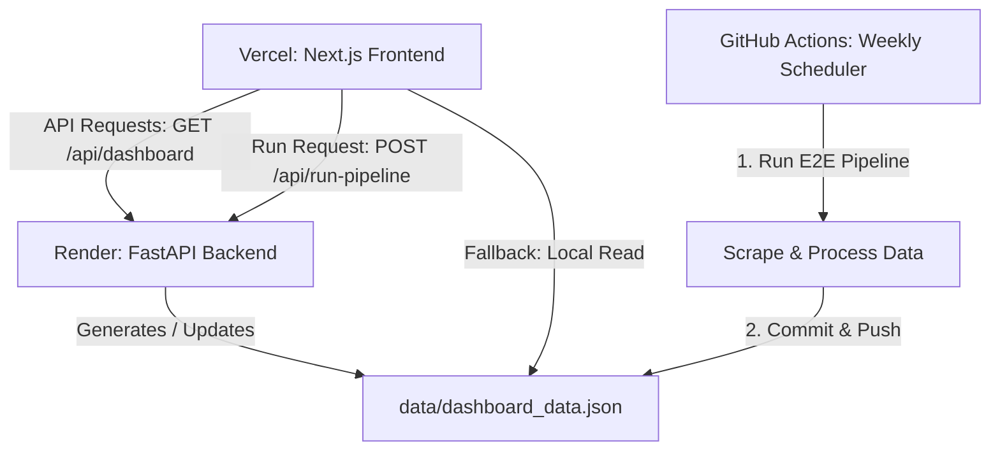

# Zepto AI-Powered Cross-Category Discovery Engine (PRDE) — Deployment Plan

This document outlines the step-by-step procedure to deploy the Zepto PRDE application. The architecture divides the system into two distinct deployments, combined with a scheduled runner for continuous data ingestion.

---

## 🏗️ Architecture Overview



1. **Frontend (Vercel Free Tier)**: A serverless Next.js web application hosting the interactive, premium dark-themed dashboard. 
2. **Backend (Render Free Tier)**: A Python-based FastAPI service running on a Render Web Service. It manages the server-side pipeline executions, streams logs in real-time, and serves structured JSON data.
3. **Weekly Data Sync (GitHub Actions)**: Ingests new reviews, processes them, and commits the final `dashboard_data.json` directly back to the GitHub repository.

---

## 🛠️ Step 1: Backend Deployment on Render (Free Tier)

Render will host the FastAPI server (`src/server.py`).

### ⚠️ Render Free Tier Constraints & Mitigations
*   **Spin-Down (Sleep Mode)**: Render's Free Tier automatically puts web services to sleep after **15 minutes of inactivity**. 
*   **Cold Starts**: When a new request (like clicking "Run Pipeline" on the dashboard) arrives, Render will spin the container back up. This cold start can take **50–70 seconds**.
*   **Next.js Instant Load Fallback**: To ensure a premium user experience, the Next.js frontend has a fallback built into `/api/dashboard`. If the Render backend is sleeping, the dashboard will load **instantly** by reading the local `public/dashboard_data.json` committed by GitHub Actions, meaning users never have to wait for the backend to wake up just to view metrics.
*   **Keep-Warm Mitigation**: If you want to prevent the backend from sleeping, you can set up a free HTTP pinging service (e.g. [UptimeRobot](https://uptimerobot.com/) or [cron-job.org](https://cron-job.org/)) to GET `https://<your-backend-app>.onrender.com/` once every 14 minutes.

### 1. Configure the Web Service (Using Render Blueprints)
The backend is configured via a Blueprints specification (`render.yaml`) using Render's native **Python 3** environment on the Free tier.

To deploy using the blueprint:
1. Log in to [Render](https://render.com/).
2. Click **Blueprints** → **New Blueprint Instance**.
3. Select your GitHub repository.
4. Render will read the `render.yaml` file automatically and provision a native Python web service named `zepto-prde-backend` under the `free` plan.

Alternatively, to configure the **Web Service** manually:
*   **Name**: `zepto-prde-backend`
*   **Runtime**: `Python 3`
*   **Plan**: `Free`
*   **Build Command**:
    ```bash
    pip install -r requirements.txt && playwright install chromium
    ```
*   **Start Command**:
    ```bash
    uvicorn src.server:app --host 0.0.0.0 --port $PORT
    ```

### 2. Environment Variables
In the Render Web Service settings, navigate to the **Environment** tab and add the following keys:

| Key | Value | Description |
| :--- | :--- | :--- |
| `GROQ_API_KEY` | `gsk_...` | Your Groq API cloud key. |
| `GEMINI_API_KEY` | `AQ.Ab8...` | Your Gemini API cloud key. |
| `NEON_DATABASE_URL` | `postgresql://...` | Your NeonDB connection string. |
| `GROQ_CLASSIFIER_MODEL` | `gpt-oss-120b` | Model used for review classification. |
| `GROQ_GATE_MODEL` | `llama-3.1-8b-instant` | Model used for gate funnel. |
| `GEMINI_SUMMARY_MODEL` | `gemini-2.5-flash` | Model used for pulse note generation. |
| `ZEPTO_APPLE_APP_ID` | `1575323645` | Zepto App Store ID. |
| `ZEPTO_ANDROID_PACKAGE` | `com.zeptoconsumerapp` | Zepto Play Store Package Name. |
| `ZEPTO_TWITTER_HANDLE` | `ZeptoNow` | Zepto Twitter/X handle. |
| `ZEPTO_TRUSTPILOT_URL` | `https://www.trustpilot.com/review/zepto.com` | Target review URL. |
| `PYTHONUNBUFFERED` | `1` | Ensures logs are sent instantly. |
| `PYTHON_VERSION` | `3.11` | Configures Render to use Python 3.11. |

---

## ⚡ Step 2: Frontend Deployment on Vercel (Free Tier)

Vercel will host the Next.js single-page application under the `frontend/` directory.

### ⚠️ Vercel Free Tier Constraints & Mitigations
*   **10-Second Execution Timeout**: Vercel's Hobby (Free) Tier limits serverless functions (like Next.js API routes) to a maximum execution duration of **10 seconds**. If the API route needs to call the Render backend, and the backend is sleeping, waking it up (~50s) will cause the Vercel API route to timeout.
*   **The Mitigation (Client-Side Rendering)**: Because our visualizer pages are compiled as **Client Components** (`'use client'`), they load the layout instantly and fetch data asynchronously from the browser. The frontend `/api/dashboard` API route is optimized to read the compiled `public/dashboard_data.json` file from the local repository build when the backend is unreachable or waking up, ensuring zero timeouts and sub-second page loads.

### 1. Import Project to Vercel
Log in to [Vercel](https://vercel.com/), click **Add New** → **Project**, and select your GitHub repository.

### 2. Configure Directory Settings
Configure Vercel to target the frontend subdirectory so it builds Next.js correctly:
*   **Root Directory**: `frontend`
*   **Build Command**: `next build`
*   **Output Directory**: `.next`

### 3. Configure Environment Variables
Under the **Environment Variables** section in Vercel, add:

| Key | Value | Description |
| :--- | :--- | :--- |
| `BACKEND_URL` | `https://zepto-prde-backend.onrender.com` | Replace with your live Render Web Service URL. |
| `DASHBOARD_DATA_PATH` | `../data/dashboard_data.json` | Path where Next.js reads dashboard data. |

---

## 🤖 Step 3: Configure GitHub Actions Scheduler

The weekly scheduler runs automatically on GitHub's infrastructure.

1. Ensure the `.github/workflows/weekly_pipeline.yml` file is committed to your `main` branch.
2. In your GitHub repository settings, add secrets:
   * `GROQ_API_KEY`
   * `GEMINI_API_KEY`
   * `NEON_DATABASE_URL`
   * `GROQ_CLASSIFIER_MODEL`
   * `GROQ_GATE_MODEL`
   * `GEMINI_SUMMARY_MODEL`
   * `ZEPTO_APPLE_APP_ID`
   * `ZEPTO_ANDROID_PACKAGE`
   * `ZEPTO_TWITTER_HANDLE`
   * `ZEPTO_SUBREDDITS`
   * `ZEPTO_TRUSTPILOT_URL`
3. Go to **Settings** → **Actions** → **General**:
   * Under **Workflow permissions**, select **"Read and write permissions"** and click **Save**.

---

## 🔍 Verification & Troubleshooting

### 1. Testing Backend Integrity
Visit the root URL:
`https://zepto-prde-backend.onrender.com/`

Expected response:
```json
{
  "status": "online",
  "service": "Zepto AI-Powered Cross-Category Discovery Engine (PRDE) Backend API",
  "version": "1.0.0"
}
```
